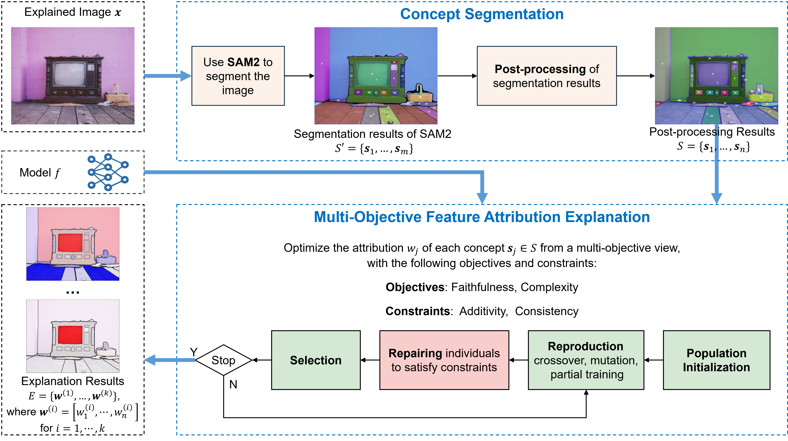

# **Concept-based Multi-Objective Feature Attribution Explanation (CMOFAE)**

This is the code for the paper "A Concept-based Multi-objective Feature Attribution Explanation Method for Deep Neural Networks in Image Classification", in which we propose a concept-based multi-objective feature attribution explanation approach that provides explanations at the concept level and considers both faithfulness and complexity objectives as well as additivity and consistency constraints.

## Overview




## SAM2

This project is based on SAM2 and the entire `./sam2_repo/` folder originates from [https://github.com/facebookresearch/nbm-spam](https://github.com/facebookresearch/sam2).

After pulling the project, please download the [SAM2 checkpoint](https://dl.fbaipublicfiles.com/segment_anything_2/072824/sam2_hiera_large.pt)  “sam2.1_hiera_large.pt” and place it in `. /sam2_repo/checkpoints`.

## Run CMOFAE

Simply run the following command:

```
python CMOFAE_main.py
```

## Result

Results will be stored in the folder `./Result/time`, e.g., `./2025-03-09-153202`. 
* `F.csv`: record the evaluation results of all the individuals.
* `X.csv`: record the explanation results of all the individuals.

